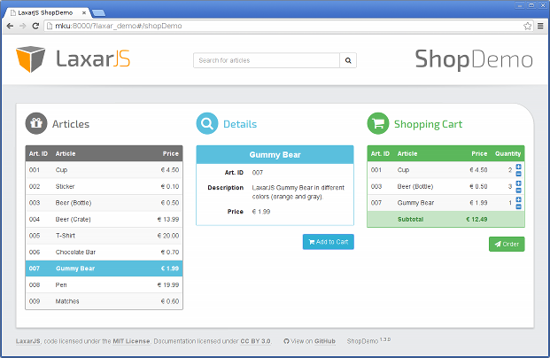

# Creating Themes

[« return to the manuals](index.md)

Sometimes you would like to use _one widget_ in _two or more applications_.
For this, usually you want the widget to _behave identically_, but _look differently_.
Alternatively, sometimes you would like to offer the same application in different appearances.
LaxarJS has the concept of _themes_ to help you achieve these things.

Preliminary readings:

* [LaxarJS Core Concepts](../concepts.md)
* [Widgets and Activities](./widgets_and_activities.md)
* [Writing Pages](./writing_pages.md)

## Why Themes?

LaxarJS ships with a so-called _default theme_, which is actually just [Bootstrap CSS](http://getbootstrap.com/css/) together with [Font Awesome](http://fortawesome.github.io/Font-Awesome/) and a few additional classes.
There are several ways to add your own styles.


### From Ad-Hoc Styles to Theme Folders…

Usually, you will need to add some CSS classes of your own.
For example, the vast majority of web application needs some styling for the page background and positioning or custom header- and footer-areas.
To include such _ad-hoc styles_, you _could_ simply add a CSS file of your own to the project, and load it from the `debug.html` and `index.html` files using the `<link>` tag.
However, it is _recommended_ to add these styles to your main application layout instead, into a sub-folder called `default.theme/css`.

The _benefit_ of using such a _theme folder_ is that

  * your CSS will be _bundled and compressed_ together with Bootstrap (no `<link>` tag needed) and that
  * you can support different _themes_ simply by adding more `.theme` folders.

Due to the first point, using the theme folders is useful and recommended _even_ if you only use (and maybe customize) the default theme.


### …and to Custom Themes

As soon as you use multiple page layouts, the previous approach does not really scale anymore: you would have to duplicate your global styles to all of them.
In these cases, creating your own theme is definitely recommended.
A detailed explanation of [creating a theme](#creating-a-theme) is given below.


### A Note on Compass/SCSS

When using theme folders or entire themes, the runtime will only ever look at `.css` files in `css` sub-folders.
This means that it is entirely _up to you_ which (if any) CSS authoring tools you would like to use.

That being said, we use Compass/SCSS to create themes, and the default-theme is based on the SCSS version of Bootstrap.
Using this approach makes it very easy to create a custom theme just by changing some Bootstrap SCSS variables.
Also, by using SCSS variables defined in the theme, widgets and controls can provide a consistent appearance.
After explaining themes in general, further down we give instructions on [creating an SCSS theme](#creating-an-scss-theme).


<a name="creating-a-theme"></a>
## Creating Your Own Theme

Let us create our own theme for an existing application, the [LaxarJS ShopDemo](http://laxarjs.org/demos/shopdemo/).
The ShopDemo brings it's own _"cube.theme"_, which is implemented by augmenting Bootstrap with some changes and custom additions, such as the circle icons used with the headlines.



**_Above:_ The LaxarJS ShopDemo using the _cube_ theme**

However, the demo also works with just the default theme, provided by LaxarJS UiKit, although admittedly it does not look quite as pretty:


**_Above:_ The LaxarJS ShopDemo using the _default_ theme**

### A Custom Theme Using Plain CSS

Since all applications seem to offer a "dark" look these days, let us try to achieve this for our shop demo app.
Fortunately, there are several collections of nice bootstrap themes available for free.
On the site [Bootswatch](http://bootswatch.com) for example, you will find the theme _[darkly](http://bootswatch.com/darkly/)_, which looks like it might work for us.

The only thing that is actually _required_ for a theme to work are a configuration entry and a CSS file in the right place.
Put the pre-built [darkly css](http://bootswatch.com/darkly/bootstrap.css) into the right place, which is `includes/themes/darkly.theme/css/theme.css`.
The path prefix `includes/themes/` may be changed using the RequireJS configuration path `laxar-path-themes`.
In the LaxarJS configuration (usually `application/application.js`), change the property `laxar.theme` from _"default"_ to _"darkly"_.
This causes the LaxarJS runtime to use the new theme.

Because the ShopDemo uses [Font Awesome](http://fortawesome.github.io/Font-Awesome), we need to add an import to the top of our CSS file for that as well:

```CSS
@import url("//maxcdn.bootstrapcdn.com/font-awesome/4.2.0/css/font-awesome.min.css");
```

Before opening the application in the browser, make sure to restart the development server, so that the new files are picked up.
And _voilà_, we have a dark web shop:


**_Above:_ The all-new ShopDemo using the _darkly_ theme, hopefully not for any shady business**

Of course, there are still some rough spots that need additional work:
For example, the widget headers look much better using the original LaxarJS demo theme.

Let's fix that using _widget-specific styles:_
The widget styles use a _category/name_ directory structure, similar to that of the actual widgets.
Here are some suggestions for a nicer look, to be put under `widgets/shop-demo`:


* _article-browser-widget_: `article-browser-widget/css/article-browser-widget.css`

  Here we color the icon, the headline to match the logo, and the currently selected article to match the details widget.

```CSS
/** Customize header and icon color: */
.article-browser-widget h3 i {
  color: #F90;
}

.article-browser-widget th {
  background-color: #F90;
  color: #222222;
}

/** Highlight the selected article. */
.article-browser-widget tr.selected td {
  font-weight: bold;
  background: #3498DB;
}
```


* _article-teaser-widget_: `article-teaser-widget/css/article-teaser-widget.css`

  Here we color the icon and the headline to match the button.

```CSS
/** Customize header and icon color: */
.article-teaser-widget h3 i {
   color: #3498DB;
}

.article-teaser-widget h4 {
   background-color: #3498DB;
   padding: 8px;
}
```


* _shopping-cart-widget_: `shopping-cart-widget/css/shopping-cart-widget.css`

  Again, we color the icon and the headline to match the button.

```CSS
/** Customize header and icon color: */
.shopping-cart-widget h3 i {
   color: #00bc8c;
}

.shopping-cart-widget th {
   background-color: #00bc8c;
}

/** plus/minus buttons */
.shopping-cart-widget .app-increase-quantity {
   text-align: right !important;
}

.shopping-cart-widget .app-increase-buttons {
   padding: 0;
   padding-top: 6px;
   width: 40px;
}

.shopping-cart-widget .app-increase-buttons button {
   padding: 0;
}
```

Now we have four different CSS files.
Of course, we do not want users to download an additional CSS file for each widget that we use.
Instead, we use `grunt laxar-dist` to create a merged version, which we may load through the `index.html`.


**_Above:_ The all-new ShopDemo using the _darkly_ theme with widget styles. Not too shabby, eh?**

Have a look at the [dark theme in action](//laxarjs.github.io/shop-demo/darkly.html#/shopDemo).

Of course, there are still some areas of improvements to this way of styling widgets.
For example, if we would like to change the shade of blue that is used in our theme, we would have to update multiple source code locations.
It would be better to have some way to define these values in our theme and reuse them from individual widgets.  


<a name="creating-an-scss-theme"></a>
### Adding a Theme using Compass/SCSS

To support centralized variables, you can use a _compiles-to-CSS_ language such as _[SCSS/SASS](http://sass-lang.com/)_ or _[less](http://lesscss.org/)_.
At the LaxarJS team we like [Compass](http://compass-style.org/), which is built on top of SCSS.
Fortunately, an SCSS-version of the darkly theme is available, and can be installed using [Bower](http://bower.io/).

Our SCSS theme uses a single central `compass/config.rb` for the theme itself, and for individual widgets.
The `config.rb` has a similar role for SCSS as the `require_config.js` has for the project's javascript modules: it tells Compass where to find SCSS libraries.
When compiling widget CSS, the path to the config should be passed on the command line:

```SH
compass compile -c /path/to/shop-demo/includes/themes/darkly_scss.theme/compass/config.rb
```

With the [right config](https://github.com/LaxarJS/shop-demo/blob/master/includes/themes/darkly_scss.theme/compass/config.rb) in place, the [SCSS for our theme](https://github.com/LaxarJS/shop-demo/tree/master/includes/themes/darkly_scss.theme/scss) is little more than a couple of imports.
Execute `compass` from any parent folder containing the `scss`, `css` and possibly also `fonts` and `images` directories.
Note that you can probably configure your editor or IDE to always pass the `-c` option correctly, otherwise you can create a shell alias.
You can also automatically generate the correct arguments by using [grunt-laxar-compass](https://github.com/laxarjs/grunt-laxar-compass), which also supports live recompilation as SCSS files change.

The advantage of using an SCSS theme is that we can now write concise widget styles using central variables.
As an example, here is the SCSS file for the _article-browser-widget_:

```SCSS
@import "variables_all";

.article-browser-widget {

  h3 i {
    color: $app-color-logo;
  }

  th {
    background-color: $app-color-logo;
    color: $body-bg;
  }

  tr.selected td {
    font-weight: bold;
    background: $brand-info;
  }
}

```

Which CSS framework and tool chain to use (if any) is ultimately up to you.
The [shop demo on github](https://github.com/LaxarJS/shop-demo) contains the _darkly_ theme both as a [plain CSS version](//github.com/LaxarJS/shop-demo/tree/master/includes/themes/darkly.theme), and as an [SCSS version](//github.com/LaxarJS/shop-demo/tree/master/includes/themes/darkly_scss.theme).

The Bootstrap framework incurs some degree of boilerplate, but makes it relatively easy to reuse widgets across applications, and to find controls that work with your theme out of the box.


## How the Runtime Finds CSS

As mentioned above, the LaxarJS runtime and grunt tasks do not care _how_ you create your CSS.
However, these tools need to find it, so it is important _where_ the CSS files are.
For details on how CSS and other assets are loaded, have a look at the [asset lookup manual](asset_lookup.md).

In general, the lookup order goes like this:

  1. if there are _theme-specified styles_ for an artifact (bundled with the application theme in use), then use those
  2. if there are _theme-specified styles_ for an artifact (bundled with the artifact itself), then use those
  3. else if there are _default styles_ for an artifact then use those
  4. else load _nothing_

Of course, _load nothing_ means that it is completely fine for a widget not to have its any CSS styles.
If it was missing an HTML template on the other hand, that would simply be an error.
