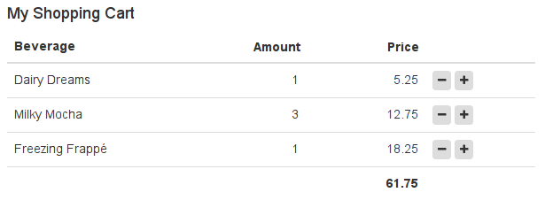

[<< return to the manuals](index.md)

Preliminary readings:

* [LaxarJS Core Concepts](../concepts.md)


# Widgets and Activities

Widgets and activities are the _"work horse"_ of any LaxarJS application.
They make up the bulk of the user interface and provide all client-side application logic.


## Widget Responsibilities

Before starting to implement your widget, take a moment to think and delineate it's responsibilities.
You can do this by phrasing the question: _What goal does this widget help the user to accomplish?_
Are you thinking about a very broadly applicable, technical task such as _"allow the user to enter a date"_ or _"allow the user to delete a data row"_?
In this case you might want to implement this functionality as a _control_ (an AngularJS directive or an HTML5 web component) and use it _within_ one or more of your widgets.

Usually, widgets correspond to significant areas of the screen and are composed from multiple controls.
They are built with a _specific user-goal_ in mind, such as _"allow the user to book a flight"_ or _"allow the user to review shopping cart contents"_.
If widgets are made too small and too generic, page definitions will be confusing and the widget configuration options become unwieldy.
As a rule of the thumb, only very complex pages should contain more than a about a dozen widgets.
And who wants to have very complex pages anyway?


### When to use Activities

Activities are _"invisible widgets"_ that are used to _fetch and manage application resources_.
Within the page, they may represent a REST API or a data store, fetching resources and performing relevant service calls (such as a form submission) upon action request.
This makes activities perform a role similar to AngularJS services.
The advantage over services is that using activities puts the _page author_ in control over instantiation and configuration:
Individual widget instances may each be connected to their own activity instance, or share an event bus topic with a single instance.
Although these configurations are not impossible to achieve using AngularJS dependency injection and -services, using LaxarJS activities makes the connections declarative and visible.

Activities may also serve as a _mediator_ between widgets that use mutually incompatible event vocabularies (such as different resource formats).
This may happen when integrating a widget from a third party into an application.


## How to Create a Widget

The easiest way to create a widget is to use the appropriate _grunt-init_ template.
Check out the [README](../../README.md) on how to obtain the grunt-init templates and on creating an application.

Start by creating a sub-directory for your new widget within the LaxarJS application.
Each widget in an application lives within a sub-folder of the _widget root_ (`includes/widgets` by default).
To change the widget root you can modify the RequireJS-path `'laxar-path-widgets'` in the require configuration.
The widget path `includes/widgets/shopping/cart_widget` is used as an example path throughout this manual.

The sub-directory _shopping_ is the _widget category_ in the example path.
Categories allow to organize widgets by their general business area, for example _shopping_, _social_, _finance_ and so on.
The last component of the widget path is the _widget name_:
It has to be unique throughout an application and must be written in lower case letters with components separated by underscores.
Regular widget names always end in `_widget` whereas activities always end in `_activity`.

To create the actual widget, run:

```sh
    grunt-init laxar-widget
```

A wizard will ask for some details on the widget such as license and author, but you can always edit this information in the widget sources afterwards.
In the following steps, it is assumed that you used the category _shopping_ and the widget name _cart_widget_ as above.


### Widget Files

A newly created widget contains the following files:

* `widget.json`

  This _widget specification_ contains meta-data about your widget that is used by the LaxarJS framework.
  It allows you to describe the configuration options of your widget features as a JSON schema.

* `bower.json`

  This specifies the _dependencies_ of your widget for use with [Bower](http://bower.io/).
  While not used directly by LaxarJS, it is the key to automated and isolated widget tests.

* `cart_widget.js`

  The _business logic_ of your shopping cart (like calculating a total or changing item quantities) as an _AngularJS controller_.
  When your controller is instantiated by the LaxarJS runtime, it will receive an AngularJS scope (the model) and a reference to the event bus, which allows for communication with the world.
  When built for release, all controllers and their RequireJS-dependencies are bundled into a single, compressed JavaScript file.

* `default.theme/cart_widget.html`

  The _AngularJS HTML template_ defining the _appearance_ of your widget.
  When your widget is used on a page, LaxarJS will load this automatically and bind it to your widget controller's scope.
  The [Bootstrap CSS](http://getbootstrap.com/css/) classes are available by convention to facilitate uniform styling across widgets.
  If Bootstrap does not suit you, feel free to use a different framework (or none at all), but keep in mind that this limits opportunities for widget reuse.
  Similarly to controllers, all widget templates will be preloaded within a single JSON file when your application is packaged for release.

* `default.theme/(s)css/cart_widget.(s)css`

  Widget-specific _style definitions_.
  Most of the time, your widget is fine just using CSS style definitions from the global application theme.
  In this case, it can do completely without CSS (or [SCSS](http://sass-lang.com/) folders.
  Sometimes though, you have style definitions which are widget-specific (such as CSS animations) and should not be part of the global theme.
  If your widget has its own CSS file, the framework will load it when the widget is used in an application, and bundle it for release.

LaxarJS supports to change the appearance of an existing widget by overriding its template or its CSS styles from within a custom _theme_.
It is also possible to put shared style definitions (CSS classes and SCSS variables) as well as shared assets like fonts and images into that theme.
To get started with some simple styling, you do not have to concern yourself with themes or SCSS.
However they are very useful for adapting widgets to different applications and web sites.
Read [more about themes](./creating_themes.md) once you are familiar with creating and using widgets.


### Widget Files for Testing

The sub folder `spec` contains the widget spec test and associated resources.
None of these files are loaded during regular application runtime:

* `spec/spec_runner.html`

  For convenience, LaxarJS provides a spec runner for each new widget, to run jasmine spec tests in the browser.
  This file does not need to be touched at all.

* `spec/spec_runner.js`

  Configuration for the spec test.
  This file needs to be modified only if widget-specific external dependencies are required during testing.

* `spec/cart_widget_spec.js`

  This is the actual [jasmine](http://jasmine.github.io/1.3/introduction.html) spec test.
  The test harness (providing a simulated LaxarJS event bus) has already been prepared for you.


### Implementing a Controller

To write the controller for your widget, you'll need to implement some business logic.
For a very simple shopping cart this means

* summing the contents of the cart

* increasing or decreasing the quantity of individual positions within the cart.

The grunt-init template has already created an empty controller along with some AngularJS infrastructure (module and injections).
For a shopping cart, this might be an appropriate starting implementation based on some dummy data:

```JS

    // ...

    function Controller( $scope ) {
       $scope.model = [
          { label: 'Dairy Dreams', price: 5.25, amount: 1 },
          { label: 'Milky Mocha', price: 12.75, amount: 3 },
          { label: 'Freezing Frappé', price: 18.25, amount: 1 }
       ];

       $scope.increment = function( item ) {
          ++item.amount;
       };

       $scope.decrement = function( item ) {
          item.amount = Math.max( 0, item.amount - 1 );
       };

       $scope.total = function( rows ) {
          return rows.reduce( function( acc, next ) {
             return acc + next.price*next.amount;
          }, 0 );
       };
    }

    // ...

```

We can see that a widget controller in LaxarJS works just like any other AngularJS controller.
Of course things will get more interesting once you use the event bus to receive shopping cart contents from somewhere else, or to signal that an order should be placed.


### Creating a Template

The purpose of creating an HTML template is to provide your widget with an appearance on the screen.
For anyone familiar with Bootstrap and AngularJS, most of this should not be a surprise:

```HTML

    <h4 ng-bind-html="features.headline.htmlText"></h4>
    <table class="table">
       <thead>
       <tr>
          <th>Beverage</th>
          <th class="cart-price">Price</th>
          <th class="cart-amount">Amount</th>
          <th></th>
       </tr>
       </thead>
       <tfoot>
       <tr>
          <th colspan="3" class="cart-price">{{ total( model ) }}</th>
          <th></th>
       </tr>
       </tfoot>
       <tr ng-repeat="item in model">
          <td>{{ item.label }}</td>
          <td class="cart-amount">{{ item.amount }}</td>
          <td class="cart-price">{{ item.price }}</td>
          <td>
             <button data-ng-click="decrement( item )" class="btn btn-xs"><i class="fa fa-minus" /></button>
             <button data-ng-click="increment( item )" class="btn btn-xs"><i class="fa fa-plus" /></button>
          </td>
       </tr>
    </table>

```

Note that the LaxarJS runtime will wrap the DOM of each widget within a single DIV container.
The scope of the template is the same as for the controller so that `model`, `decrement`, `increment` and `total` will be available upon template instantiation.
The `features` property used within the headline comes from the _widget configuration_, which is described below.


### Adding Some Style

A widget may be styled using CSS.
LaxarJS supports generating the CSS from SCSS source files, allowing to place common definitions for font size, color and much more within a shared "theme" folder.
To keep things simple, you can ignore SCSS and themes for now and simply write a CSS file for your widget, in our case under `default.theme/css/cart_widget.css`.
Once you are familiar with the basics, read the article on [creating themes](./creating_themes.md) for more information.

Thanks to Bootstrap this widget does not require a lot of fancy styling:

```CSS

    .cart-widget .cart-amount,
    .cart-widget .cart-price {
       text-align: right;
    }

```

For best encapsulation, selectors should be prefixed with the widget class (`cart-widget`) as shown here.
LaxarJS automatically adds this class to the widget container, so there is no need to specify it in the widget template.
It is also recommended to prefix custom CSS classes as shown here (`cart-amount`, `cart-price`), just as you would prefix custom AngularJS elements or attributes when creating a directive.
This makes widget styles more robust against changes in Bootstrap or other third party CSS.


### Configuration Options

When looking at the template, you might have wondered where the `features.headline.htmlText` came from.
This is a _feature configuration_ option of our widget:
We want to be able to control the headline text for each instance of our widget.
For this reason, we make it configurable by adding a feature entry to the `widget.json`:

```JSON

    {
       "name": "CartWidget",
       "description": "Allows Users to Review and Modify Purchase Items",

       "features": {
          "$schema": "http://json-schema.org/draft-04/schema#",
          "type": "object",
          "properties": {
             "headline": {
                "type": "object",
                "properties": {
                   "htmlText": {
                      "type": "string",
                      "description": "The HTML headline content."
                   }
                }
             }
          }
       }
    }

```

The _widget features_ are a [JSON schema](http://json-schema.org) document that is used by LaxarJS to verify pages.
It contains a property for each configurable feature, and it also allows to specify default values as needed.
This makes it easy to provide self-documenting customization options for your widget.
See the [reference section](#reference) for details on the widget specification.


### Checking out the Result

Before we can take a look at the widget, we will need to integrate it into the page provided by the application template (`application/pages/page1.json`).

```JSON

    {
       "layout": "one_column",

       "areas": {
          "activities": [],
          "header": [],
          "content": [
              {
                 "widget": "shopping/cart_widget",
                 "features": {
                    "headline": {
                       "htmlText": "My Shopping Cart"
                    }
                 }
              }
          ],
          "footer": []
       }
    }

```

There is another manual to learn more about [writing pages](./writing_pages.md).

Now we can start the development web server provided by LaxarJS, from the application root:

```SH

    npm install # if you haven't already
    npm start

```

Navigate to `http://localhost:8000/debug.html` to admire the fruits of your labor:



Now that you have learned the basics in creating widgets, take a closer look at widget testing.


## Testing a Widget

One of the major goals of LaxarJS is to simplify the development _and testing_ of isolated components.
For this reason, the testing infrastructure for your widget has already been added when using `grunt-init`.


### Writing Spec-Tests

LaxarJS contains a testing infrastructure to mock out the LaxarJS runtime, effectively running your widget in a sandbox or _test bed_ as it is called in LaxarJS.
A skeleton spec is already provided for you:
It contains code to prepare the test bed with sample configuration and to instantiate your controller.

To mock out AngularJS services such as `$http` you can work with [ngMocks](https://docs.angularjs.org/api/ngMock) just like you would do without LaxarJS.
To add a simple test for our widget, replace the existing dummy test

```JS

    it( 'still needs some tests.' );

```

with a more useful spec:

```JS

    it( 'allows to calculate a total of its contents', function() {
        expect( testBed_.scope.total( testBed_.scope.model ) ).toEqual( 61.75 );
    } );

```

Tests get more interesting when you instrument the testbed to publish mock events to be handled by the widget controller, and in turn to inspect events published by the widget.
For more details on testing event bus communication, refer to the [article on events](./events.md).


### Running the Test

Now make sure that the development web server is still running and check out the test results using the [provided spec runner](http://localhost:8000/includes/widgets/shopping/cart_widget/spec/spec_runner.html):


Alternatively, you can run the tests for all your widgets from the command line:

```JS

    npm test

```

LaxarJS provides [grunt tasks](https://github.com/LaxarJS/grunt-laxar) for testing that automatically set up and run [PhantomJS](http://phantomjs.org/) for you, so you should not run into problems accessing the DOM.
Hopefully this makes it simple to set up continuous integration for your application.


<a name="reference"></a>
## LaxarJS Widget Reference

Building on top of the basics covered so far, sometimes it is helpful to know about all the options available to widget authors.
This section covers the details of the widget specification format and of the LaxarJS test bed.

### The Widget Scope

The widget controller and the template have access to the widget scope.
The scope may be used by widget controllers to communicate with directives such as `ngForm`.
To avoid entanglement, multiple widgets (even if nested) do *not* communicate through the scope but *always use the event bus* for this.

* `$scope.eventBus`

  Most of the time, this is the only LaxarJS scope property used by widget controllers.
  Of course, controllers will almost always add their own properties.

* `$scope.widget.id`

  A unique identifier for this widget within the page.
  You can use it to generate unique DOM IDs, for example to connect `label` and `input` elements in an HTML form.


### The Widget Specification Format

Each widget has a `widget.json` file which is also called _widget specification_.
LaxarJS contains a [widget schema definition](../../static/schemas/widget.json) that defines the exact format of this file.
These are the most important widget properties:

* `name`

  This required field contains the _CamelCase_ version of the widget's directory name.

* `description`

  What this widget is about.
  Ideally, this contains the main _user-goal_ mentioned in the first section.

* `features`

  The widget features.
  This is a JSON schema document that documents all configurable widget features.
  For each widget instance used on a page, LaxarJS will check the feature configuration of that instance against this schema.
  This also allows to provide default values for configuration options.

* `compatibility`

  An optional list of new LaxarJS features that this widget is compatible with.
  It allows individual widgets to _opt in_ to breaking LaxarJS changes (similarly to the Python _import from future_ construct), without harming widgets that do not yet support these changes.

* `controls`

  An optional list of LaxarJS controls used by this widget.
  Each control is represented by its RequireJS path.
  This allows the LaxarJS runtime to automatically load the AngularJS modules and CSS styles associated with these controls whenever your widget is used.
  Refer to [Providing Controls](./providing_controls.md) for on loading user interface components and their resources in this manner.


### The LaxarJS Widget Test Bed

The LaxarJS spec test boilerplate (provided for you by grunt-init) creates a `testBed_` instance which is re-initialized prior to running each test case.
It has the following essential properties.

* `testBed_.featuresMock`

  The feature configuration to use during the spec test, to be specified by the author of the test.
  It has the same format that would be provided through the page definition within an actual application.
  Note that `featuresMock` must be set before calling `testBed_.setup()`.

* `testBed_.setup()`

  Creates the widget controller.
  Afterwards, the `testBed_.scope` is available.
  This simulates navigating to a page that contains an instance of the widget under test.

* `testBed_.tearDown()`

  Destroys the widget controller.
  This is the testing equivalent to navigating away from the page that contains the widget instance.

* `testBed_.scope`

  The AngularJS scope that was created for this widget.
  This allows to inspect widget state in white-box tests.

* `testBed_.eventBusMock`

  A handle to the LaxarJS event bus that allows spec tests to simulate other widgets on the same page.
  Through it, the spec test can publish events for manipulating the widget, and in turn subscribe to events published by the widget controller.
  This is different from the `testBed_.scope.eventBus` handle which is used by the widget controller.
  Tests may use `spyOn` on the scope event bus to monitor widget behaviour directly, or interact with the `eventBusMock` to communicate with the widget indirectly.
